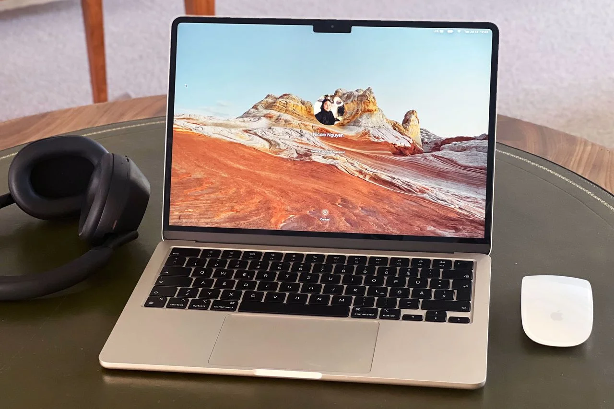
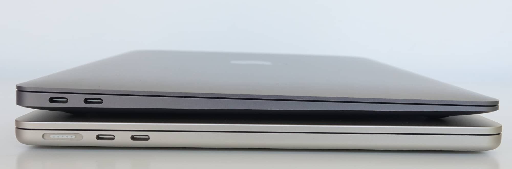

feature/photos

*Macbook Air M2:*It is worth starting with the display – it now has thinner bezels, similar to those introduced in the previous generation of the MacBook Pro. This design has significantly increased the usable area of the display. The dimensions of the new MacBook Air are almost identical to those of the older model, and even the weight remains unchanged, with a difference of only a few grams. The case continues to be made from premium aluminum, and when closed, the new MacBook Air remains incredibly slim.

*About:*The touchpad has been slightly expanded and the power button has also been enlarged, now including a fingerprint scanner (Touch ID). To the left of the device, there are two unused USB Type-C ports, with the laptop charging via a modified MagSafe port.

feature/similar-devices
MacBook Pro 13" M2 - a more powerful laptop for tasks that require active cooling and long-lasting performance. - MacBook Air M1 - the previous generation, providing excellent value for money. - Dell XPS 13 - a Windows alternative with a similar design and compactness.

feature/name
The MacBook Air M2 is a modern laptop from Apple, 
released in 2022. It features a lightweight body, 
long battery life

feature/specifications
- Dimensions: 30.41 × 21.5 × 1.13 cm - Weight: 1.24 kg - Processor: Apple M2, 8-core - Memory: up to 24 GB - Storage: SSD up to 2 TB - Display: 13.6" Liquid Retina (2560×1664) - Battery: up to 18 hours of operation - Ports: 2 × Thunderbolt / USB-C, MagSafe 3

The MacBook Air M2 is an ultra-thin notebook designed for 
learning, working, and creating. It features a 
14-hour battery, a Liquid Retina display, and the Apple M2 chip, which delivers high performance 
with minimal power consumption
develop
develop
develop
develop
